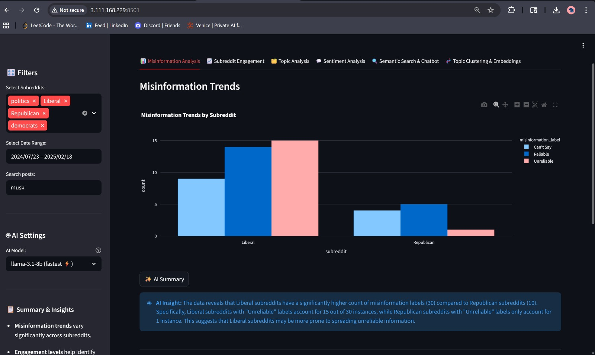
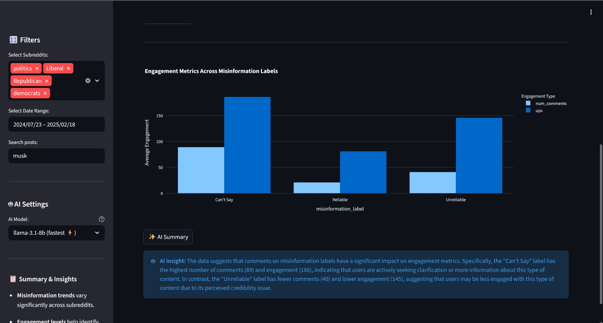
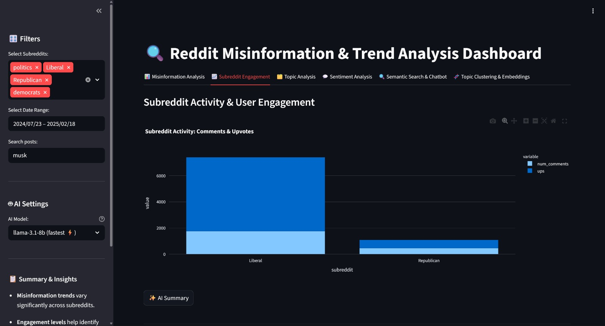
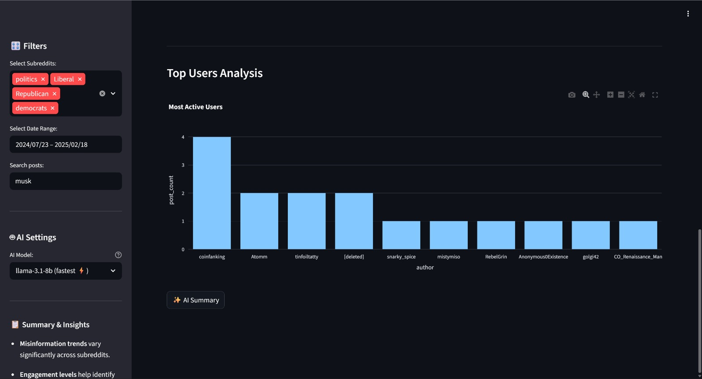
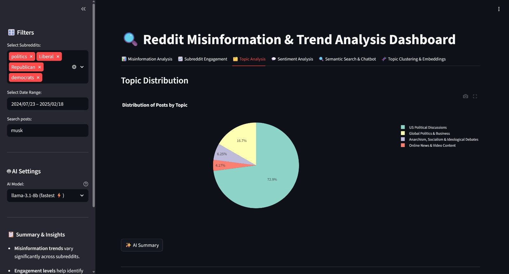
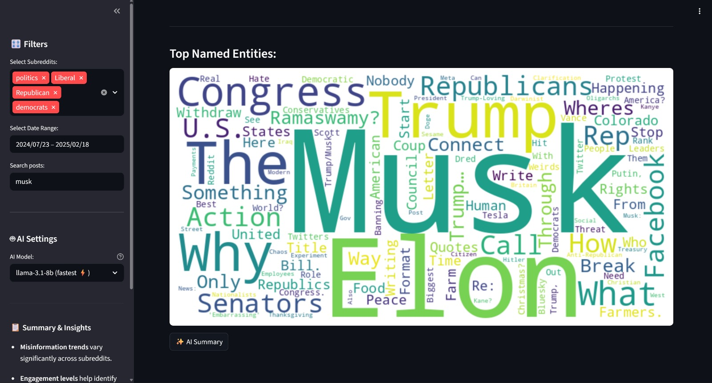
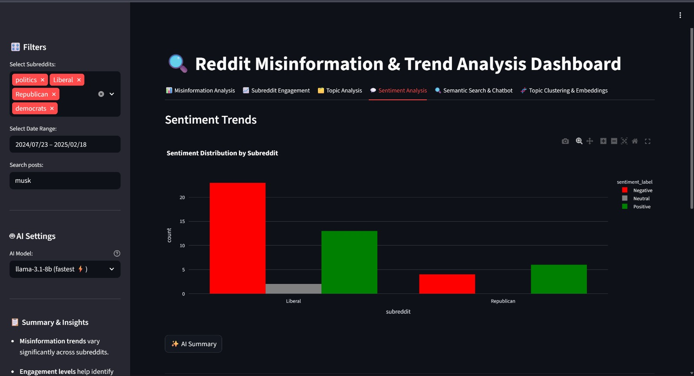
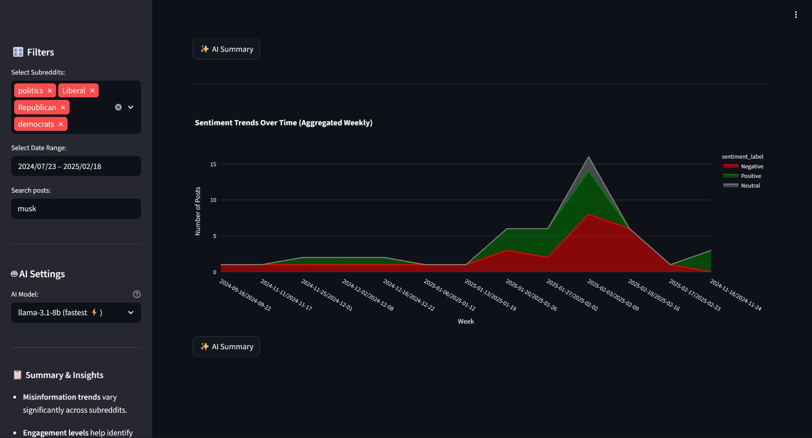
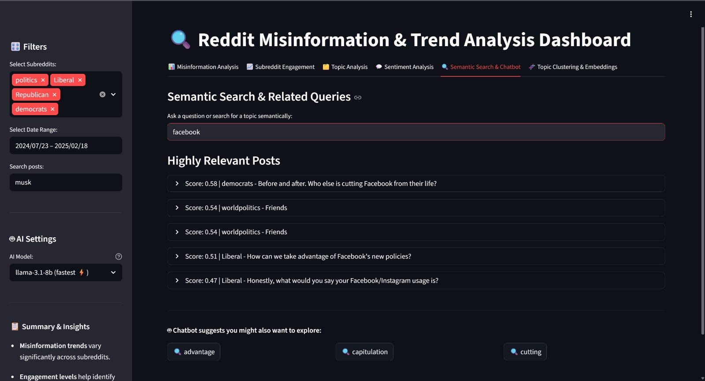
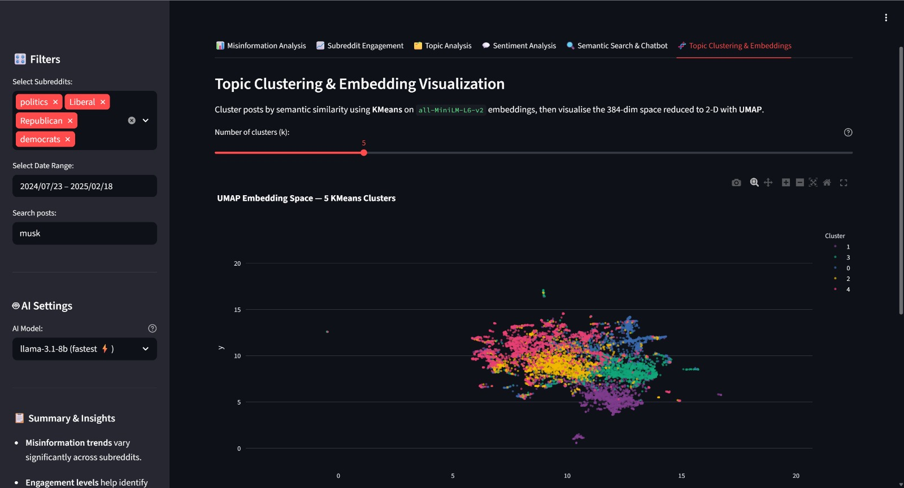

# 🔍 Reddit Misinformation & Narrative Intelligence Dashboard

## 🔗 Live Hosted Link & Demo
**Live App:** [http://3.111.168.229:8501/](http://3.111.168.229:8501/)  
**Video Demo:** [https://youtu.be/FxnyfsgmwU4](https://youtu.be/FxnyfsgmwU4)

> 🟢 **Deployed on AWS EC2** — The application is live on an **AWS EC2 `t3.medium` Ubuntu instance** (`ap-south-1` region). The AI inference engine (**Llama 3.2 via Ollama**) runs **locally on the same EC2 instance** — no external AI API calls, fully self-contained.

---

## 📌 Project Overview
A sophisticated, end-to-end Streamlit application designed to analyze Reddit data with a focus on misinformation tracking, community engagement, sentiment analysis, and dynamic topic modeling.

The core innovation of this project lies in its integration of advanced Natural Language Processing (NLP), conceptual semantic search, and an embedded **AI Summary Assistant**. Powered by a **locally hosted Large Language Model (`Llama 3.2` via `Ollama`) running directly on an AWS EC2 instance**, the dashboard distills complex data into concise, natural language insights — zero dependency on third-party closed-source AI APIs.

> **Infrastructure:** Deployed on **AWS EC2** (`t3.medium`, Ubuntu 22.04, `ap-south-1`). Ollama is installed and served on the EC2 host itself, making AI inference private, fast, and cost-effective.

---

## ✨ Features
- **Brain-like Semantic Search Engine:** Moves beyond rigid keyword matching (SQL `LIKE` operator). Uses `all-MiniLM-L6-v2` embeddings to map concepts, allowing users to search by "meaning" instead of arbitrary character strings.
- **Embedded AI Analyst Data Summaries:** A fully integrated `Llama 3.2` AI agent generating real-time natural language summaries of Plotly charts and metrics.
- **Misinformation Footprint Tracking:** Quantifies and visualizes the prevalence of misinformative content, mapping its engagement velocity across different subreddits.
- **Advanced Sentiment Timeline:** Utilizes VADER lexicon approaches to label emotional sentiment (Positive, Negative, Neutral) and maps public opinion evolutions dynamically over a specified time series.
- **Machine Learning Clustering & UMAP Mapping:** Automatically groups untagged conversational themes using `KMeans`, executing dimensionality reduction via `UMAP` to plot 384-dimensional semantic text vectors onto a brilliant 2D interactive space.
- **Context-Aware "Chatbot" Recommendations:** Dynamically evaluates the TF-IDF feature space of search queries to actively suggest related exploration topics to the user.

---

## 🛠️ Tech Stack
**Frontend / Orchestration**
- [Streamlit](https://streamlit.io/) — Interactive, rapid analytical application framework.

**Data & Mathematical Foundation**
- `pandas` & `numpy` — Fast, robust data manipulation.
- `plotly`, `matplotlib`, `wordcloud` — Rich data visualization.

**NLP & Machine Learning Engine**
- `sentence-transformers` — Generates dense text embeddings (`all-MiniLM-L6-v2`).
- `scikit-learn` — Cosine similarity ranking, KMeans clustering, and TF-IDF extraction.
- `umap-learn` — High-dimensional mapping and reduction.
- `nltk.sentiment` — VADER lexicon-based polarity scoring.

**Generative AI Integration**
- `ollama` — Run open-source language models locally on bare metal.
- `Llama-3.2` — 8-billion parameter instruction-tuned LLM handling chart summaries.

---

## 📂 Project Structure
```text
.
├── app.py                      # Main Streamlit dashboard application
├── clean.csv                   # Preprocessed Reddit dataset (5.6 MB, ingested by app)
├── cleaning.ipynb              # Jupyter notebook — raw data cleaning & EDA pipeline
├── requirements.txt            # Python package dependencies
├── deploy.sh                   # One-command AWS EC2 provisioner (installs Ollama + app)
├── AWS_DEPLOY_GUIDE.md         # Step-by-step AWS EC2 provisioning walkthrough
├── INSTRUCTIONS.md             # Original assignment brief & requirements
├── manav-prompts.md            # AI prompt engineering notes & LLM interaction log
├── .gitignore                  # Git ignore rules
├── README.md                   # This documentation file
├── .streamlit/
│   └── secrets.toml            # Streamlit secrets (Groq API key, config)
└── screenshorts/               # App screenshots (10 images)
    ├── 1.jpeg  ├── 2.jpeg  ├── 3.jpeg  ├── 4.jpeg  ├── 5.jpeg
    ├── 6.jpeg  ├── 7.jpeg  ├── 8.jpeg  ├── 9.jpeg  └── 10.jpeg
```

---

## 📸 Screenshots

| | |
|:---:|:---:|
|  |  |
|  |  |
|  |  |
|  |  |
|  |  |

---

## 🚀 Local Installation & Execution

### 1. Prerequisites
- Python 3.10+
- [Ollama](https://ollama.com/) installed and running reliably on your host machine.

### 2. Setup
Clone the repository to your desktop or cloud workspace:
```bash
git clone https://github.com/YOUR_USERNAME/YOUR_REPO_NAME.git
cd YOUR_REPO_NAME
```

Launch a virtual environment and install the dependencies:
```bash
python3 -m venv venv
source venv/bin/activate
pip install -r requirements.txt
```

Download the required local AI Model inside Ollama:
```bash
ollama pull llama3.2
```

### 3. Run the App
Ensure the Ollama daemon is active in the background, then spin up the Streamlit interface:
```bash
streamlit run app.py
```
*The app will be accessible at `http://localhost:8501`*

---

## ☁️ Deployment — AWS EC2 with Local LLM

### Architecture

```
┌─────────────────────────────────────────────────────┐
│               AWS EC2  (t3.medium)                  │
│           Ubuntu 22.04 · ap-south-1                 │
│                                                     │
│  ┌──────────────────┐   ┌────────────────────────┐  │
│  │  Streamlit App   │──▶│  Ollama (Local LLM)    │  │
│  │  app.py : 8501   │   │  Llama 3.2 · port 11434│  │
│  └──────────────────┘   └────────────────────────┘  │
│                                                     │
│  Security Group: TCP 8501 open to 0.0.0.0/0         │
└─────────────────────────────────────────────────────┘
             ▲
    Public IPv4: 3.111.168.229
```

- **No Docker** — Ollama and Streamlit run as native system processes.
- **No external AI API** — Llama 3.2 runs entirely on the EC2 instance's CPU/RAM.
- **Self-contained** — All inference is private and on-premise within the EC2 boundary.

### One-Command Deploy

Follow **[`AWS_DEPLOY_GUIDE.md`](AWS_DEPLOY_GUIDE.md)** to provision the Ubuntu server, then SSH in and run:

```bash
chmod +x deploy.sh
./deploy.sh
```

The script automatically:
1. Installs Python 3, pip, and all `requirements.txt` dependencies
2. Installs **Ollama** and pulls **`llama3.2`** model (~2 GB)
3. Starts the Ollama daemon as a background service
4. Launches Streamlit on `0.0.0.0:8501`

*Your application, local LLM, and all dependencies will be live within **5–10 minutes**.*

### EC2 Instance Details
| Parameter | Value |
|---|---|
| Provider | AWS EC2 |
| Region | `ap-south-1` (Mumbai) |
| Instance Type | `t3.medium` (2 vCPU / 4 GB RAM) |
| OS | Ubuntu 22.04 LTS |
| Public IP | `3.111.168.229` |
| App Port | `8501` |
| LLM Engine | Ollama — `llama3.2` |
| LLM Port | `11434` (localhost only) |
